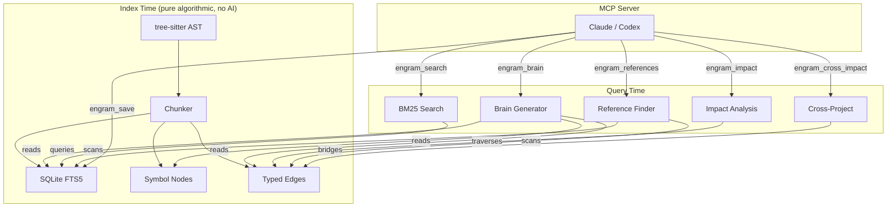
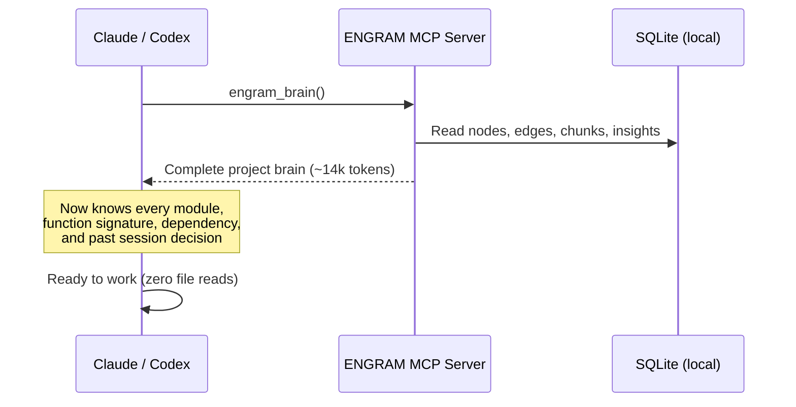
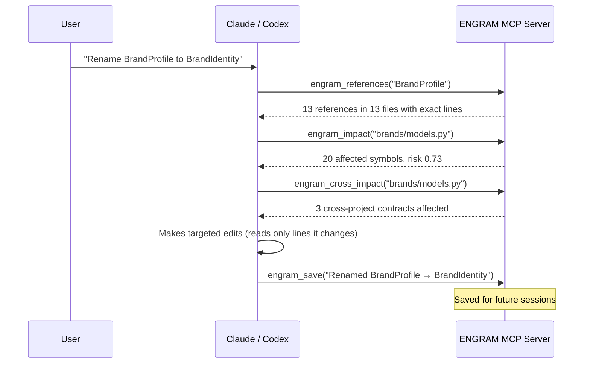
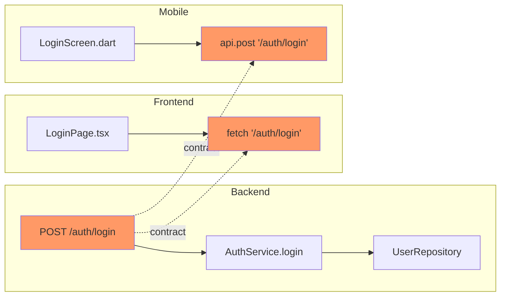

# ENGRAM

Complete project memory for AI code assistants. One call, full context, zero guessing.

ENGRAM gives LLMs persistent, symbol-level knowledge of your entire codebase across sessions. No extra AI models, no cloud, no API keys. Built on SQLite FTS5 and tree-sitter.

```bash
pip install engram-memory
engram init                 # index your project
engram install              # wire into Claude Code / Codex
```

## What It Does

Your AI assistant starts every session knowing nothing. ENGRAM fixes that.

```
Without ENGRAM                          With ENGRAM
─────────────────────                   ─────────────────────
Session starts → blank                  Session starts → engram_brain()
"What is this project?" → read 10+     → 14k tokens: every module,
  files, still incomplete                 every function signature,
"Fix the auth bug" → grep, read 5        every dependency, every
  more files, guess at structure          past decision
Total: 20+ file reads                  Total: 0 file reads to start
```

## Architecture



## How It Works

### Session Start



### Making a Change



### Cross-Project Awareness



When you change a backend endpoint, `engram_cross_impact` finds every frontend and mobile file that consumes it.

## MCP Tools

| Tool | Purpose |
|------|---------|
| `engram_brain` | Complete project brain. Call first on session start. |
| `engram_search` | BM25 full-text search with synonym expansion |
| `engram_compact_search` | Metadata-only search (saves tokens) |
| `engram_symbols` | Find functions/classes by name pattern |
| `engram_save` | Persist a decision or insight for future sessions |
| `engram_references` | Find ALL references to a symbol across the project |
| `engram_impact` | Blast-radius: what breaks if you change this file? |
| `engram_cross_impact` | Cross-project: what breaks in other repos? |
| `engram_trace` | Follow import/dependency chains |
| `engram_brain` | Complete project context in one call |
| `engram_status` | Index health and project info |
| `engram_list_projects` | All indexed repos and workspaces |
| `engram_workspace_create` | Group repos for cross-repo search |
| `engram_set_context` | Set session search scope |

## Project Brain

The brain is not a markdown file. It is a compressed, structured representation of the entire project that the LLM processes in full.

```
PROJECT: ContentPlatform
  AI-powered SaaS for brand social content generation
  Stack: FastAPI, PostgreSQL, SuperTokens, Celery+Redis

MODULES:
  [auth] User authentication, JWT, Google/Apple OAuth
    files: models.py, oauth.py, repository.py, router.py, security.py, service.py
    · service.py:27-77 class AuthService
    · service.py:49-77 async def login(email: str, password: str) → LoginResponse
    · security.py:15-28 def create_access_token(user_id: str) → str
    § User: email(str), password_hash(str | None), full_name(str)
    § LoginResponse: access_token(str), refresh_token(str), expires_in(int)
    uses: common, core, organizations

  [brands] Brand profiles, RAG persona builder
    · models.py:29-84 class BrandProfile(BaseModel, TenantMixin)
    · persona_builder.py:23-25 build_brand_persona_from_url(url: str)
    § BrandProfile: name(String), voice_summary(Optional[str]), colors(Optional[dict])
    uses: common, core, generation

KEY FLOWS:
  [API] POST /auth/login (auth) → common → core
  [API] POST /brands/{id}/analyze (brands) → common → generation
  [TASK] execute_generation_job (tasks) → core

MEMORY:
  ! Brand colors extracted via Playwright screenshot, NOT HTML parsing
  ! N+1 in analytics fixed with selectinload, don't remove it
```

Every symbol has its file and exact line range. The LLM can target `service.py:49-77` without reading the file first.

## Setup

### Install

```bash
pip install engram-memory
```

### Index a Project

```bash
cd your-project
engram init
```

### Wire into Claude Code

```bash
engram install
```

This adds the MCP server to `~/.claude/settings.json` and injects usage instructions into your project's `CLAUDE.md`.

### Index Multiple Projects

```bash
cd backend && engram init
cd ../frontend && engram init
cd ../mobile && engram init
```

### Create a Workspace (Cross-Repo Search)

```bash
engram workspace create "MyApp" /path/to/backend /path/to/frontend /path/to/mobile
```

## CLI Commands

| Command | Description |
|---------|-------------|
| `engram init [path]` | Index a project directory |
| `engram status` | Show all indexed projects and health |
| `engram brain [path]` | Generate and display the project brain |
| `engram search "query"` | Test search from terminal |
| `engram reindex [path]` | Force full re-index |
| `engram workspace create NAME [paths...]` | Create a workspace |
| `engram workspace add NAME path` | Add repo to workspace |
| `engram workspace list` | List all workspaces |
| `engram auto-save` | Extract insights from Claude Code history |
| `engram install` | Add MCP server to Claude Code settings |

## Benchmarks

Tested against ContentPlatform (342 files, 314 indexed):

| Metric | Score |
|--------|-------|
| Hit@1 (correct file is top result) | 75% |
| Recall@3 (correct file in top 3) | 90% |
| Recall@5 (correct file in top 5) | 95% |
| MRR (mean reciprocal rank) | 0.838 |
| Brain tokens (full project) | ~14k |
| Index time | 0.7s |

Cross-project on GakkoDeck (4 repos, 1542 files):

| Metric | Score |
|--------|-------|
| Brain tokens (all 4 projects) | ~14k |
| Context window usage | 6.9% of 200k |
| Cross-project contract detection | 16 contracts matched |

## What Gets Indexed

| Data | Storage | Method |
|------|---------|--------|
| Code symbols | Nodes table | tree-sitter AST (18 languages) |
| Full-text content | Chunks + FTS5 | BM25 inverted index |
| Import relationships | Edges table | Regex + AST |
| Call relationships | Edges table | Regex heuristic |
| Inheritance chains | Edges table | AST class parsing |
| Test coverage links | Edges table | File + function pattern matching |
| Session insights | Chunks table | Explicit `engram_save` calls |
| API endpoints | Extracted at query time | Route decorator parsing |
| Cross-project contracts | Computed at query time | Endpoint-to-consumer matching |

## Language Support

**18 languages with AST parsing:** Python, JavaScript, TypeScript, Go, Rust, Java, C, C++, C#, Ruby, PHP, Swift, Kotlin, Scala, Dart, Elixir, Haskell, Lua

**16 languages with regex fallback:** SQL, Bash, Markdown, YAML, TOML, JSON, XML, HTML, CSS, SCSS, Vue, Svelte, Jupyter, and more

## Tech Stack

| Component | Choice |
|-----------|--------|
| Storage + Search | SQLite FTS5 (built into Python) |
| AST Parsing | tree-sitter |
| File Watching | watchdog |
| MCP Framework | mcp (official Python SDK) |
| CLI | click |
| Extra AI Models | None |

Zero external services. Everything runs locally. Total install size ~20MB.

## License

MIT
